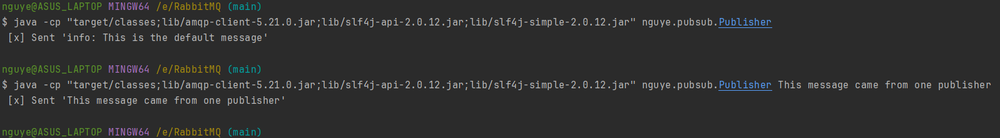
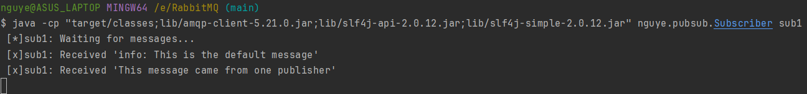
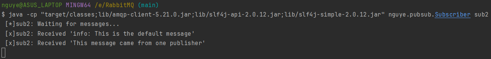

## Using publish/subscribe
#### Use a *fanout exchange* to dispatch messages from one publisher to all subscribers.
#### The publisher only need to know about the exchange where it sends messages to. The responsibility of routing messages to queues to be delivered to the subscribers is taken by that exchange.
#### Here we are binding the fanout exchange to only one queue, so all messages go to the subscribers through that queue.
<br>

#### Compile the source files:
```
javac -d target/classes -cp lib/amqp-client-5.21.0.jar src/main/java/nguye/pubsub/*.java
```
#### Run the subscribers to receive messages:
```
java -cp "target/classes;lib/amqp-client-5.21.0.jar;lib/slf4j-api-2.0.12.jar;lib/slf4j-simple-2.0.12.jar" nguye.pubsub.Subscriber sub1
```
```
java -cp "target/classes;lib/amqp-client-5.21.0.jar;lib/slf4j-api-2.0.12.jar;lib/slf4j-simple-2.0.12.jar" nguye.pubsub.Subscriber sub2
```
#### Run the publisher to dispatch messages:
```
java -cp "target/classes;lib/amqp-client-5.21.0.jar;lib/slf4j-api-2.0.12.jar;lib/slf4j-simple-2.0.12.jar" nguye.pubsub.Publisher
```

#### Subscriber 1 receives all messages:

#### Subscriber 2 receives all messages:
