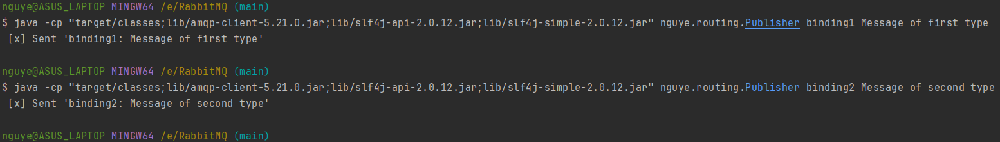
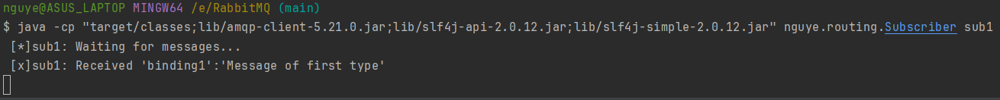
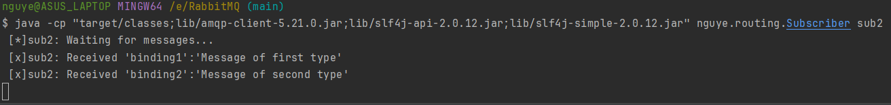

## Using message routing
#### Use a *direct exchange* to dispatch specific messages from the publisher to specific subscribers.
#### Here we have two queues, each serves one subscriber and has one (or two) bindings between it and the exchange.
#### We create two binding between the exchange and the queue of subscriber 2, therefore it can receive both types of message.
#### Each binding between a queue and an exchange is identified by its binding key.
#### Every message that sent to the exchange with a routing key will be routed (by the exchange) to the queue whose binding key exactly matches the routing key of the message.
<br>

#### Compile the source files:
```
javac -d target/classes -cp lib/amqp-client-5.21.0.jar src/main/java/nguye/routing/*.java
```
#### Run the subscribers to receive messages:
```
java -cp "target/classes;lib/amqp-client-5.21.0.jar;lib/slf4j-api-2.0.12.jar;lib/slf4j-simple-2.0.12.jar" nguye.routing.Subscriber sub1
```
```
java -cp "target/classes;lib/amqp-client-5.21.0.jar;lib/slf4j-api-2.0.12.jar;lib/slf4j-simple-2.0.12.jar" nguye.routing.Subscriber sub2
```
#### Run the publisher to dispatch two messages, one of each type:
```
java -cp "target/classes;lib/amqp-client-5.21.0.jar;lib/slf4j-api-2.0.12.jar;lib/slf4j-simple-2.0.12.jar" nguye.routing.Publisher binding1 Message of first type
```
```
java -cp "target/classes;lib/amqp-client-5.21.0.jar;lib/slf4j-api-2.0.12.jar;lib/slf4j-simple-2.0.12.jar" nguye.routing.Publisher binding2 Message of second type
```

#### Subscriber 1 receives only one message:

#### Subscriber 2 receives both messages:
