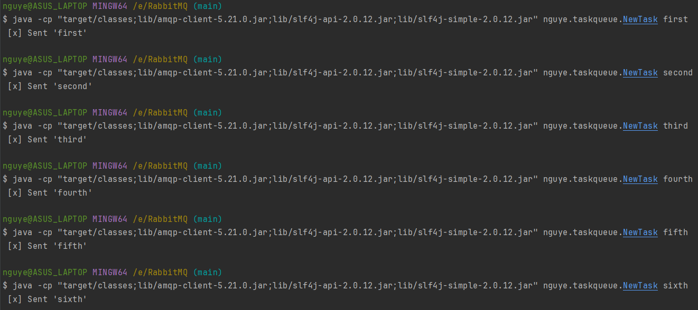
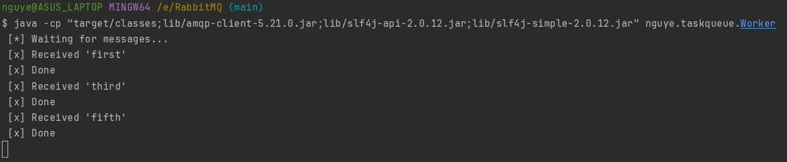
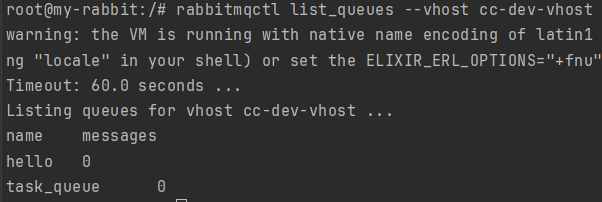
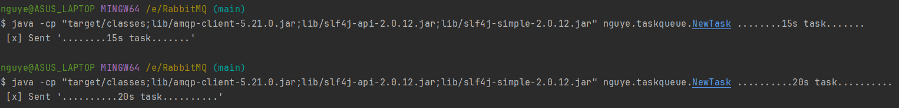
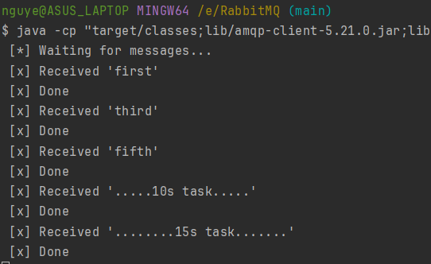
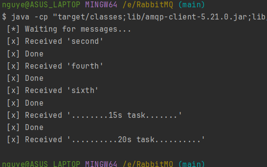
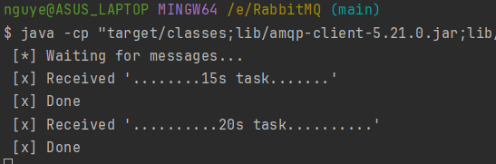
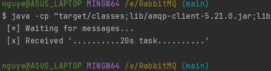
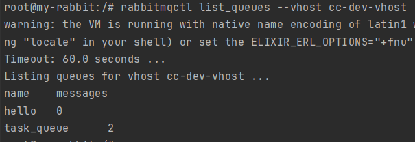

## Using task queue

#### Publish and consume tasks via the `task_queue` queue inside the `cc-dev-vhost` vhost.

#### List the queues lie inside the `cc-dev-vhost` vhost
```
rabbitmqctl list_queues --vhost cc-dev-vhost
```

#### Compile the source files:
```
javac -d target/classes -cp "target/classes;lib/amqp-client-5.21.0.jar;lib/slf4j-api-2.0.12.jar;lib/slf4j-simple-2.0.12.jar" src/main/java/nguye/taskqueue/*.java
```

#### Run two workers (in separated terminal instances):
```
java -cp "target/classes;lib/amqp-client-5.21.0.jar;lib/slf4j-api-2.0.12.jar;lib/slf4j-simple-2.0.12.jar" nguye.taksqueue.Worker
```

#### Create several tasks which take less than 1s to be done (immediately), and publish them to the queue:
```
java -cp "target/classes;lib/amqp-client-5.21.0.jar;lib/slf4j-api-2.0.12.jar;lib/slf4j-simple-2.0.12.jar" nguye.taskqueue.NewTask <task_name>
```


#### The two workers handle the tasks in parallel:



#### Now there are no messages in the queue


#### Create two time-consuming tasks, and publish them to the queue:
```
java -cp "target/classes;lib/amqp-client-5.21.0.jar;lib/slf4j-api-2.0.12.jar;lib/slf4j-simple-2.0.12.jar" nguye.taskqueue.NewTask ........15s task....... 
```
```
java -cp "target/classes;lib/amqp-client-5.21.0.jar;lib/slf4j-api-2.0.12.jar;lib/slf4j-simple-2.0.12.jar" nguye.taskqueue.NewTask ..........20s task.......... 
```


#### Each worker receive a task, and one them dies while handling the task:



#### With `autoAck` set to *true*, all messages discarded from the queue:


#### With `autoAck` set to *false*, if a worker dies while handling a task, that task will be re-delivered to the other worker:



#### All messages remain in the queue:
