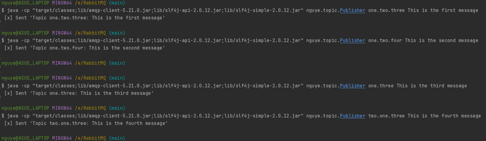
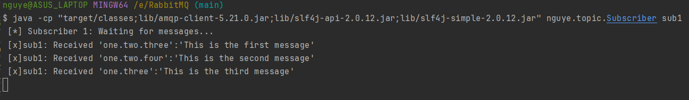
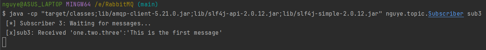

## Using topic exchange
#### A topic exchange is like a more flexible and complex version of a direct exchange. It allows sending different types of message to one queue without the need of multiple binding.
#### With a direct exchange we can only have one criterion to route the messages (decide which message should go to which queue). But with a direct exchange, we are allowed to have multiple criteria to do so.
#### Messages sent to a topic exchange cannot have arbitrary `routing_key`. It must be a list of words, delimited by dots. The `binding_key` must also be in the same form.
#### Routing keys used with a topic exchange have a pattern. A message must have the routing key follows that pattern in order to be routed to the expected queue.
#### We have three subscribers, each of them subscribes to a different topic, and want to receive only the messages related to that topic. Here, each topic is determined by a binding between the subscriber's queue and the exchange.
<br>

#### Compile the source files:
```
javac -d target/classes -cp lib/amqp-client-5.21.0.jar src/main/java/nguye/topic/*.java
```
#### Each subscriber is interested in a specific topic:
- Subscriber 1: `one.#`
- Subscriber 2: `*.two.*`
- Subscriber 3: `*.two.three`

#### Run the subscribers:
```
java -cp "target/classes;lib/amqp-client-5.21.0.jar;lib/slf4j-api-2.0.12.jar;lib/slf4j-simple-2.0.12.jar" nguye.topic.Subscriber sub1
```
```
java -cp "target/classes;lib/amqp-client-5.21.0.jar;lib/slf4j-api-2.0.12.jar;lib/slf4j-simple-2.0.12.jar" nguye.topic.Subscriber sub2
```
```
java -cp "target/classes;lib/amqp-client-5.21.0.jar;lib/slf4j-api-2.0.12.jar;lib/slf4j-simple-2.0.12.jar" nguye.topic.Subscriber sub3
```

#### Run the publisher to dispatch four messages, each related to different topics:
```
java -cp "target/classes;lib/amqp-client-5.21.0.jar;lib/slf4j-api-2.0.12.jar;lib/slf4j-simple-2.0.12.jar" nguye.topic.Publisher one.two.three This is the first message
```
```
java -cp "target/classes;lib/amqp-client-5.21.0.jar;lib/slf4j-api-2.0.12.jar;lib/slf4j-simple-2.0.12.jar" nguye.topic.Publisher one.two.four This is the second message
```
```
java -cp "target/classes;lib/amqp-client-5.21.0.jar;lib/slf4j-api-2.0.12.jar;lib/slf4j-simple-2.0.12.jar" nguye.topic.Publisher one.three This is the third message
```
```
java -cp "target/classes;lib/amqp-client-5.21.0.jar;lib/slf4j-api-2.0.12.jar;lib/slf4j-simple-2.0.12.jar" nguye.topic.Publisher two.one.three This is the fourth message
```

#### Subscriber 1 receives three messages:

#### Subscriber 2 receives two messages:

#### Subscriber 3 receives one messages:

#### The fourth message is not related to any topic subscribed by any subscriber and therefore discarded.